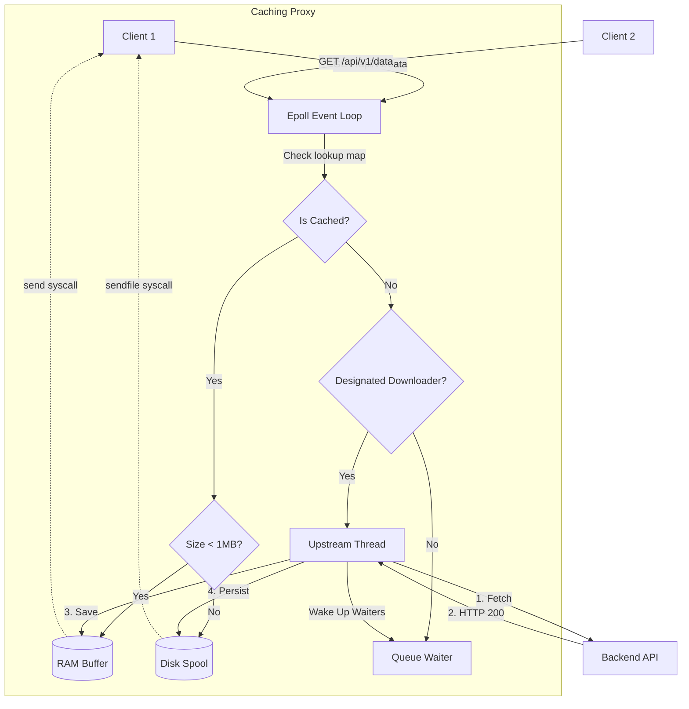

# High-Performance API Caching Proxy

A fast, multithreaded caching reverse proxy built entirely in C, explicitly designed to accelerate web servers and database gateways.

## 📌 Introduction

This project is an **API Gateway Cache**. Its core goal is to sit between your clients and your heavily loaded backend servers (e.g., Python APIs, Node.js services, or Database endpoints) to intercept and cache repetitive read requests. 

Unlike traditional CDNs focusing on static files (like images or CSS), this proxy is engineered to cache dynamic API responses or database query results. By eagerly caching data both in-memory and on-disk, the proxy acts as an impenetrable shield for your backend, allowing it to survive massive, sudden spikes in traffic without scaling hardware.

---

## 🏗 Architecture Diagram



---

## 🧠 Core Architectural Decisions

To safely handle over 30,000+ Requests Per Second, we made several specific design and architectural choices:

### 1. Backend Shielding & Cache Stampede Prevention
A "cache stampede" happens when a popular cache item expires, and thousands of concurrent clients immediately rush the backend for the newly missing data, crashing the backend. 
Our proxy prevents this. If 1,000 clients request an expired API endpoint simultaneously, only **one** connection is marked as the "Designated Downloader" and sent to the backend. The other 999 connections are safely queued in a Waiter list. Once the single backend response arrives, the proxy releases the waiters and streams the response from the cache to everyone simultaneously. 

### 2. Persistence, Rehydration, & Dual-Send Delivery
We ensure that the cache survives process restarts and optimizes delivery based on payload sizes:
* **Disk Persistence & Rehydration**: All responses are written to disk alongside a `cache_registry.bin` metadata file. During startup, the proxy instantly "rehydrates" the cache state by loading this registry back into RAM. This defeats the volatility of RAM and ensures the proxy boots up fully warm.
* **In-Memory (`send`)**: For payloads under 1MB (like standard JSON APIs), the proxy holds the response entirely in pre-allocated RAM buffers and serves it directly using the standard `send()` syscall for maximum speed.
* **Disk Spooling (`sendfile`)**: We *only* serve payloads natively from disk if they exceed 1MB. In these cases, the proxy uses the Linux `sendfile()` syscall to stream bytes straight out of the kernel cache directly to the socket, bypassing expensive user-space memory copying entirely.

### 3. Multi-Reactor Event Loop
Instead of crashing under C10K loads using a "one thread per connection" model, this proxy assigns a small pool of worker threads exclusively to manage `epoll` queues. This allows a handful of threads to easily context switch and juggle tens of thousands of idle, reading, or writing sockets using non-blocking I/O.

### 4. Runtime Configuration Parsing
System administrators do not need to recompile the C code to change caching limits. The proxy safely parses a `proxy.conf` configuration file directly at startup, binding memory budgets, thread counts, and rate-limiter bucket capacities. Hardcoded C macros are strictly reserved for compiler array sizing constraints.

### 5. Pass-Through TLS
The proxy focuses entirely on the logic of caching, state-machines. It deliberately does not perform SSL/TLS termination natively, ensuring we don't waste CPU cycles on encryption overhead. In a real-world stack, a load balancer (like AWS ALB or HAProxy) terminating TLS would sit directly in front of this proxy.

---

## 🚀 Benchmark Results

We benchmarked the proxy on AWS to simulate a real-world scenario of shielding a highly vulnerable backend. 

### The Infrastructure Setup
* **Load Generator**: `wrk` script running on an AWS `c7i.flex.large` instance.
* **Caching Proxy**: Running on an AWS `c7i.flex.large` instance.
* **Upstream Backend**: Running on an AWS `t3.micro` instance. This backend was intentionally kept drastically under-resourced to prove the proxy perfectly shields it from being overwhelmed under heavy load.

### The Simulated Load
* **Duration**: 3-minute sustained load.
* **Concurrency**: 2,000 simultaneous connections.
* **Target Environment**: A custom Lua script firing requests across **500 distinct API Endpoints**.
* **Traffic Distribution**: Requests followed a **Zipfian Distribution** (`alpha=1.0`) to accurately simulate realistic hot/cold API caching behavior, where a few popular endpoints generate ~90% of traffic (cache hits), and the rest make up a "long tail" of cache misses perfectly testing the stampede logic.

### Load Impact Summary

| Metric | Direct Backend Server | Caching Proxy Server (This Project) | Impact |
|--------|----------------------|-------------------------------------|-------------|
| **Throughput** | ~2,280 RPS | **~33,879 RPS** | **~14.8x Faster** |
| **Data Transfer** | 13.54 MB/sec | **~198.78 MB/sec** | **~14.6x Boost** |
| **Average Latency** | 903.82 ms | **65.89 ms - 132.23 ms** | **~85% Reduction** |
| **Total Requests Processed** | 412,629 | **6,101,539** | |


### Internal Telemetry
During the peak 33,000+ RPS sustained barrage:
* **Memory Limits Respected:** RAM usage remained highly efficient, peaking entirely structurally bounded at `~84 MB` RSS.
* **Hit Ratio:** Held firmly between **93% - 94%**, effectively absorbing the Zipfian traffic curve safely.
* **Backend Isolation:** Zero timeouts or crashes occurred upstream, proving the stampede prevention successfully choked incoming pressure to a trickle.

---

## 🛠 Build Instructions

### Prerequisites
* You must run this on a **Linux Environment** (or WSL on Windows), as the reactor heavily uses pure Linux APIs like `epoll_wait` and `sendfile`. 
* Ensure `gcc` and `make` are installed.

### Compilation
Clone the repository using git clone command  and run standard make inside the directory:

```bash
# Clean previous artifacts
make clean

# Build optimized release binary
make
```

To build with Address Sanitizers enabled for debugging memory:
```bash
make debug
```

---

## ⚙️ Setup & Usage

### 1. The Configuration File
The server checks for a `proxy.conf` file relative to the startup directory. A default file is provided in the repository with tunable parameters:

```ini
port = 3490
max_cache_mem = 52428800  # 50 MB limits
large_file_threshold = 1048576 # 1 MB sendfile transition
```

### 2. Spinning Up
Ensure your upstream API service is already running on the configured `origin_port`. Then start the proxy:

```bash
./custom_proxy_cache --port <ORIGIN_PORT> --origin <ORIGIN_HOSTNAME>
```

The system will report listener status to STDERR, automatically launch its threads, open a queue for the `proxy.log` file, and spool up the `cache/` registry folder dynamically. You can safely send thousands of HTTP requests immediately.
